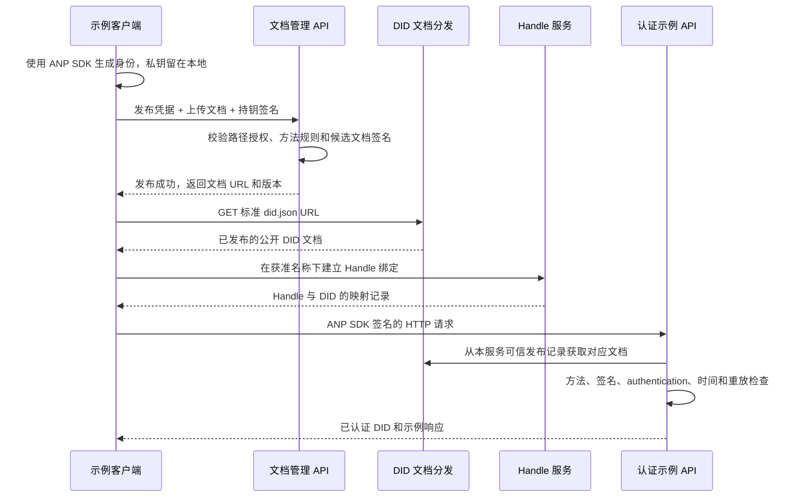

# Open DID Server 项目方案

状态：设计草案，尚未开发。

创建日期：2026-10-01。

组织：`agent-network-protocol`。

仓库：`open-did-server`。

本次交付：创建公开仓库、本地目录与方案文档；不编写服务端、客户端或测试代码。

## 1. 项目目标

Open DID Server 是一个开源 DID Server 参考实现，展示如何托管 DID 文档、提供可读名称查询，以及验证使用 ANP SDK 签名的 HTTP 请求。开发者应能通过这个项目理解关键流程，并在自己的域名下运行服务。

用户已确认需要支持的 DID 方法是 `did:wba` 和 `did:web`。名称服务使用 Handle 一词，例如 `alice.example.com`；Handler 通常表示程序中的请求处理函数，不作为这里的协议术语。WebDAV 文件管理协议不在本项目需求范围内。

首版完成以下可观察结果：

1. 客户端在本地生成 DID 文档与密钥，通过 HTTP API 上传公开文档。
2. 服务端校验文档、上传权限与发布位置，并在 DID 方法规定的 URL 分发文档。
3. 提供 Handle → DID 和 DID → Handle 查询，以及与 DID 文档声明一致的双向绑定流程。
4. 示例客户端使用现有 ANP SDK 对真实 HTTP 请求签名；服务端使用 SDK 验证签名，返回已认证 DID。
5. 提供完整的域名与 HTTPS 演示，并争取提供使用 IP 运行的本地演示，不修改 ANP SDK。

## 2. 范围与实现原则

首版采用单实例、单身份托管域名、单 Handle Provider 域名的结构，两者默认相同。服务端负责公开文档和名称记录；用户的身份私钥始终保留在客户端。

首版认证示例先接受本服务已发布、状态有效的 DID。这样可以完整展示“创建身份 → 上传 → 分发 → 签名请求 → 验签”的流程，也便于无需公网域名的本地演示。接受任意外部 DID 的通用认证服务是后续扩展，不能把本服务的登记记录当成其他域名 DID 的可信来源。

首版不实现钱包、私钥托管、完整账户系统、OAuth/VC 授权、IM/E2EE、跨域名称提供商迁移或自动身份恢复。DID 轮换、恢复和私密 Handle 确认留到后续阶段；首版不通过重新分配旧名称来模拟这些能力。

密码学、指纹计算和 HTTP 签名格式复用 ANP SDK。项目自身承担发布授权、可信文档选择、请求上下文、签名覆盖策略、时效与重放防护；这些应用责任不能省略。

## 3. 已核对的协议与 SDK 基线

本方案依据已读取的本机 SDK 和协议文件设计。以下提交均已确认存在于 GitHub；引用固定提交，避免把未提交修改或其他分支当成设计基线。

| 对象 | 已核对基线 | 相关结论 |
|---|---|---|
| ANP Python SDK | `anp`，提交 `9e8361f131bf422444ae6addca29d36a0845c203`；本地分支 `release/0929` | 支持 WBA/Web 文档解析、HTTP Message Signatures、WNS 数据模型与名称绑定工具 |
| ANP 协议 | `AgentNetworkProtocol`，提交 `262cd4514a25c6f7111b1420f54518506e5972e4` | ANP-02 负责公共请求认证，ANP-03 负责 WBA 方法，ANP-04 负责 Handle/WNS，原生 Web 按 Appendix B 兼容 |
| SDK 项目元数据 | 同一 SDK 提交中的 `pyproject.toml` 标注 `1.0.5` | 实现时仍需核对所选发布制品实际提供的 API，并锁定版本及依赖；源码版本号不替代制品验收 |

### 3.1 可以直接复用的 Python API

| 功能 | SDK 入口 | 本项目用途 |
|---|---|---|
| 新建 WBA 身份 | `create_did_wba_document(..., did_profile="e1", enable_e2ee=False)` | 客户端生成 E1/Ed25519 身份；首版认证示例无需额外 E2EE 键 |
| Web 文档方法校验 | `validate_did_document_method` | 客户端将本地 Ed25519 公钥组装为最小 Web 文档，再交给 SDK 校验与签名 |
| 可选 Web 多设备构建 | `build_web_did_document` | 该构建器要求设备描述和签名/密钥交换公钥；不作为首版单键 HTTP 认证的前提 |
| 方法校验 | `validate_did_document_method` | 校验可信公开文档的方法规则；WBA 按需要验证文档 proof |
| 解析文档 | `resolve_did_document` | 对外解析示例；显式本地配置可使用 `base_url_override` |
| HTTP 请求签名 | `generate_http_signature_headers`、`DIDWbaAuthHeader` | 生成 `Signature-Input`、`Signature` 和有请求体时的 `Content-Digest` |
| HTTP 签名验证 | `extract_signature_metadata`、`verify_http_message_signature` | 从可信文档验证实际请求签名；外层补齐授权、覆盖范围、时效和重放检查 |
| 高层认证验证 | `DidWbaVerifier`、`DidWbaVerifierConfig` | 展示标准域名解析路径的现有用法；不能直接假定它可注入本地解析地址 |
| Handle/WNS | `validate_handle`、`normalize_handle`、`resolve_handle`、`build_handle_service_entry` | 名称规范化、正向查询及 DID 服务声明 |

### 3.2 需要明确的 SDK 边界

- 当前 `did:wba` 创建函数拒绝 IP hostname；ANP-03 明确禁止 DID 标识符中包含 IP。
- 旧 `create_did_wba_document_with_key_binding` 已废弃并转发到 K1 兼容 profile，不能用它生成默认 E1 身份；首版显式调用 `create_did_wba_document` 的 E1 profile。
- 当前 `did:web` URL 构造器要求 DNS hostname，拒绝 IP literal。正式解析要求公共 HTTPS、TLS 校验及准确的文档 `id`。
- `resolve_did_document(..., base_url_override=...)` 可把域名 DID 对应的资源请求发送到显式配置的本地 HTTP/IP 地址。这个参数改变传输位置，不改变 DID 的合法标识符。
- 当前 `DidWbaVerifier` 内部直接选择 WBA/Web 解析函数，配置中没有 `base_url_override` 或通用解析器注入入口。因此底层解析器支持覆盖地址，不代表高层验签器可以直接使用该参数。
- `verify_http_message_signature` 检查签名和摘要，但不能单独替代应用层认证策略。当前实现可从 `verificationMethod` 找到一个没有被 `authentication` 授权的键，也不独立强制所有必要签名组件或检查完整时间窗口和重放状态。
- 已核对的 WNS `verify_handle_binding` 使用正向记录和 Provider 域名声明完成校验；不能仅凭该工具的成功布尔值宣称已满足新版 WBA `exact-handle` 的端点解引用要求。项目的演示需明确实际执行了哪些检查。

这些是代码与文档检查结论，本次没有运行 SDK 或互通测试。

## 4. 建议技术方案

首版建议采用 Python 3.11+、FastAPI、Uvicorn、ANP Python SDK 和 SQLite，通过 UV 管理依赖。选择 Python 是为了直接复用现有 SDK 的身份构建、签名、验签和 WNS 能力，并减少示例阅读成本。这些是后续开发的建议默认值，本次不生成依赖文件或安装运行环境。

使用一个服务进程提供三个模块：

- 文档管理与分发：校验、首次发布、更新和标准 DID 文档读取。
- Handle 服务：名称预留、绑定、正向解析和反向查询。
- 认证示例：读取可信文档并验证 SDK 签名请求。

SQLite 保存文档正文、发布位置、归属、版本与名称状态。文档和相关索引在事务中更新，避免数据库和文件系统双写不同步。HTTP 分发直接读取已提交的数据；无需把用户输入直接拼成磁盘路径。

示意流程：



## 5. DID 文档发布与 HTTP 分发

### 5.1 标识符与资源 URL

文档 `id` 必须与请求登记的 DID 完全一致。发布 authority 必须属于配置的托管域名和端口；API 不为不受本服务控制的外部域名提供“权威发布”。

建议默认将两种方法放在不同路径，避免占用相同 URL：

| 方法 | DID 示例 | 标准文档 URL |
|---|---|---|
| WBA E1 路径身份 | `did:wba:example.com:identities:wba:alice:e1_<fingerprint>` | `https://example.com/identities/wba/alice/e1_<fingerprint>/did.json` |
| Web 路径身份 | `did:web:example.com:identities:web:bob` | `https://example.com/identities/web/bob/did.json` |
| WBA 根身份 | `did:wba:example.com` | `https://example.com/.well-known/did.json` |
| Web 根身份 | `did:web:example.com` | `https://example.com/.well-known/did.json` |

`<fingerprint>` 是说明用占位符，真实 E1 指纹必须由 SDK 从绑定公钥生成。

WBA 与 Web 的根身份，以及拥有相同 authority 和路径的两种 DID，会映射到同一个资源 URL，但一份 DID 文档只能有一个确定的 `id`。首版默认使用隔离的路径身份；根身份由管理员显式选一种方法启用。对整个 canonical URL 建立唯一约束，遇到冲突返回 `409`，不能按请求 Header 返回不同身份的文档。

### 5.2 上传与更新规则

上传只接收 JSON DID 文档，不接收私钥。最小校验要求：

1. 限制正文大小为 1 MiB，要求 JSON 对象，拒绝重复字段和已知私钥字段（例如 JWK 的 `d`、私钥 PEM）。
2. 仅接受 `did:wba`、`did:web`，核对 `id`、authority、受授权的 canonical 路径和托管域名。
3. 验证公钥编码、验证方法唯一性、键引用与 `controller` 关系；用于认证的键必须由该文档的 `authentication` 授权。
4. 新建 WBA 路径身份默认使用 E1，验证路径指纹与绑定公钥，按 ANP-03 校验文档 proof；原生 Web 不套用 WBA 指纹规则。
5. 对更新的 WBA 文档继续保持绑定规则；变更绑定根键会产生新 DID，首版不将其作为同一 DID 的普通更新接受。
6. 对 URI/path 做明确解析，拒绝空段、`.`、`..`、控制字符、编码后的分隔符和二次解码歧义；保留 API、健康检查与名称服务路径。
7. 保存客户端提交的公开字段与 proof。Handle 服务声明由客户端在签名前加入文档，服务器不能事后修改带签名文档来“补齐”声明。

### 5.3 首次发布的授权与认证引导

新文档尚未发布时，不能要求服务端先通过公开 URL 解析这个 DID，否则会形成循环依赖。

首版使用显式配置的发布凭据引导，默认只适用于开发者自己运行的实例。凭据授权具体托管路径与可分配名称；示例运行时使用独立、随机生成的凭据，不内置公共默认口令。

首次发布需要同时满足：发布凭据允许写入该位置，以及客户端使用候选文档中的 `authentication` 公钥对应私钥对上传请求签名。候选文档只在这个受约束的首次发布流程中用于持钥校验，不能因此获得其他账户、路径或 Handle 的权限。SDK 负责密码学验证；应用检查候选文档的方法规则和签名策略。

后续更新使用当前已发布文档的认证键校验请求，再检查已登记的发布归属。不能改为信任更新正文中新塞入的键。更新要求 `If-Match`；凭据持有者的管理能力独立于“签名有效”，两者不能混为一谈。

多用户公开托管需要独立的登记、邀请或账户授权策略，留到后续阶段。首版“用户可以上传”指持有获准发布凭据的使用者，不提供匿名任意覆盖。

### 5.4 分发行为

- `GET` / `HEAD` 返回公开 DID 文档，支持 `application/did+json`，并兼容 `application/json` 客户端。
- 使用 `ETag` 和 `If-None-Match` 返回 `304`；首版采用较短缓存时间，更新后使用新的 ETag。
- 未发布资源返回 `404`；不返回默认身份文档，不自动重定向到另一个 DID。
- 发布记录是认证示例的可信来源，不能从请求正文或任意 `did_document_url` 替换。
- 正式部署以 HTTPS 和实际域名为准；本地 HTTP 输出明确标为开发演示。

## 6. Handle → DID 与 DID → Handle

### 6.1 名称与记录

名称格式遵循 WNS：`{local-part}.{provider-domain}`，例如 `alice.example.com`。规范化为小写，复用 SDK 格式检查，同时保留协议/系统/防混淆名称。Handle 不含端口，即便对应 DID 的 authority 含有编码端口。

每个 Handle 当前对应一个 DID，首版也对 DID 的当前 Handle 建立唯一约束。已分配名称保留同一归属；撤销后保存永久 tombstone，不重新分配给另一主体。

正向入口：`GET /.well-known/handle/{local-part}`。示例记录：

```json
{
  "handle": "alice.example.com",
  "did": "did:wba:example.com:identities:wba:alice:e1_<fingerprint>",
  "status": "active",
  "binding_generation": "1",
  "updated": "2026-10-01T00:00:00Z",
  "ttl": 60
}
```

`binding_generation` 是正的十进制字符串，不能作为 JSON number 输出。每次 DID 绑定或状态变化都在事务中严格递增，不能用时间戳代替，也不能因重启、导入或备份恢复而任意重置。

反向入口：`GET /api/v1/handles/by-did?did={urlencoded-did}`，根据本服务的索引返回对应的公开 Handle 记录。它是本项目的便利查询 API，不宣称是 WNS 新增的标准解析入口，也不自动构成双向绑定证明。

首版仅支持公开 Handle。WNS 可选的私密 DID Confirmation Endpoint 不在首版内，不能在私密确认响应中暴露 Handle 来充当反向查询。

### 6.2 与 DID 文档的双向声明

客户端在上传前加入以下公开服务声明：

```json
{
  "id": "did:wba:example.com:identities:wba:alice:e1_<fingerprint>#handle",
  "type": "ANPHandleService",
  "serviceEndpoint": "https://example.com/.well-known/handle/alice"
}
```

对 WBA 公共 Handle，演示需按 ANP-04 校验：正向记录处于 `active`、DID 方法有效、DID hostname 与 Handle Provider 一致、文档中存在对应 HTTPS 声明，并实际请求声明的精确标准入口，核对返回的 Handle 和 DID。只有这些检查完成后才能报告 `exact-handle`。

对原生 Web，遵循 Appendix B.4 的既有兼容模型：正向记录对应准确的 Web DID，DID 文档声明 HTTPS Handle Provider 域名。Web 身份域名可以与 Provider 不同，但首版上传仍仅限本实例托管域名。演示标明这是 Web Provider 域名声明兼容检查，不提升为 WBA 的 `exact-handle` 或私密 `provider-confirmed` 结果。

这里所说的实际 HTTPS 声明校验需要域名运行模式。本地 HTTP/IP 模式可以演示名称记录与查询，但不报告完成生产环境的 HTTPS 双向绑定验证。

### 6.3 状态与绑定管理

`active` 返回有效记录；`suspended` 保留归属但查询不提供可用绑定；`revoked` 返回 `410` 并永久保留名称。未注册名称返回 `404`。状态变更更新 generation。

创建绑定需要名称分配授权、目标 DID 的有效认证，以及目标公开文档中的服务声明。后续状态管理同时检查账户/发布归属和签名身份。首版不开放将一个既有 Handle 重绑到另一 DID；同一主体的 DID 轮换需要后续实现 ANP-03 连续性、ANP-04 generation 和恢复策略后再启用。

## 7. HTTP API 草案

以下是首版接口建议，开发前需据此冻结字段与状态码。路径中 `document-id` 是服务端记录 ID，不是直接拼接未经解析的 DID 字符串。

| 方法与路径 | 用途 | 访问条件 |
|---|---|---|
| `GET /healthz` | 进程健康信息 | 公开，返回精简信息 |
| `POST /api/v1/did-documents` | 首次上传并发布，正文为 DID 文档 | 获准发布凭据 + 候选文档持钥签名 |
| `GET /api/v1/did-documents/{document-id}` | 查询公开文档和发布元数据 | 公开，仅含公开字段 |
| `PUT /api/v1/did-documents/{document-id}` | 更新同一 DID 的文档 | 当前公开文档认证键 + 发布归属 + `If-Match` |
| `GET/HEAD /.well-known/did.json` | 分发显式启用的根身份 | 公开 |
| `GET/HEAD /{registered-path}/did.json` | 分发已登记的路径 DID | 公开，限定于 canonical 发布索引 |
| `PUT /api/v1/handles/{local-part}` | 首次绑定，或同一绑定的状态管理 | 名称分配/管理授权 + 目标 DID 认证 + `If-Match`（更新） |
| `GET /.well-known/handle/{local-part}` | 标准 Handle → DID 查询 | 公开 |
| `GET /api/v1/handles/by-did?did=...` | 本实例 DID → Handle 查询 | 公开，首版仅公开名称 |
| `GET /examples/auth/whoami` | 演示无正文的签名请求 | ANP HTTP Message Signature |
| `POST /examples/auth/echo` | 演示请求正文完整性和签名验证 | ANP HTTP Message Signature |

首次发布成功返回 `201`，包含 `document_id`、`did`、`document_url` 和版本/ETag。格式错误返回 `400` 或 `422`，正文超限返回 `413`，资源冲突返回 `409`，缺少更新前提返回 `428`，版本冲突返回 `412`。

认证缺失、签名/摘要错误、过期或重放通常返回 `401`；身份已明确但缺少发布或名称权限时返回 `403`。若错误涉及方法或规范约定，保持对应协议语义。错误体使用稳定的 `error` 和可读 `message`，不返回密钥、令牌或内部异常堆栈。

首版认证示例每次都签名，不要求 Bearer/JWT 交换。上传用的发布凭据只负责发布授权，不是验证 DID 请求后发出的通用访问令牌。

## 8. 请求签名与服务端验签示例

### 8.1 客户端流程

示例客户端提供明确的 WBA 和 Web 选项，流程如下：

1. 读取目标服务地址、公开 DID 域名和获准发布参数。
2. WBA 使用 SDK 的 E1 创建入口；Web 使用标准 `cryptography` 库生成 Ed25519 密钥，并构建包含准确 `id`、公开 JWK、`verificationMethod` 和 `authentication` 的最小文档。两者均使用 ANP SDK 的方法校验与请求签名；密钥写入本地忽略目录，不上传私钥。Web 单键示例无需多设备构建器。
3. 加入预留的 Handle 服务声明，按对应 DID 方法生成最终公开文档及所需 proof。
4. 按实际 HTTP method、完整目标 URL 和将发送的原始正文 bytes 生成上传签名，并发送发布凭据。
5. GET 标准文档 URL，确认发布成功且返回准确 `id`。
6. 建立 Handle 绑定，执行正向、反向查询；域名模式下执行对应绑定验证。
7. 使用 `generate_http_signature_headers` 对 `GET /examples/auth/whoami` 和 `POST /examples/auth/echo` 签名；发送与签名时完全相同的 URL、Headers 和正文 bytes。
8. 展示服务端返回的已认证 DID、认证方式和示例业务数据；失败时展示明确错误。

若使用 `DIDWbaAuthHeader`，认证示例需使用 `force_new=True` 避免切换为缓存 Bearer 而掩盖每次签名的流程。默认演示现代 HTTP Message Signatures；旧 `Authorization: DIDWba ...` 兼容模式后续按明确需求增加。

### 8.2 服务端流程

采用项目自己的薄认证适配层，调用 SDK 公开函数，不改动 SDK 源码或 monkey-patch 高层验证器：

1. 在 JSON 解析前获取请求原始 bytes，读取 `Signature-Input` 与 `Signature`。
2. 提取 `keyid`，严格解析 DID 和 fragment；只从当前已发布、有效且归属于本服务的记录选取文档。首次发布使用第 5.3 节限定的独立引导路径。
3. 核对文档 `id`，执行方法规则与 WBA proof 校验。
4. 确认 `keyid` 由该 DID 的 `authentication` 授权，且键的归属和用途符合规则；仅在 `verificationMethod` 或 `assertionMethod` 中存在不足以认证。
5. 强制签名覆盖 `@method`、`@target-uri`，有请求体时还需覆盖 `content-digest`；必要时对 `content-type` 等业务关键字段要求额外签名。
6. 调用 `verify_http_message_signature`，使用真实 method、完整 URL、Headers 和原始 bytes 验证签名和摘要。
7. 检查 `created` / `expires` 和允许的时钟偏差；示例策略要求 nonce，并为 `(keyid, nonce)` 做原子去重。首版建议最大签名寿命 300 秒、允许时钟偏差 30 秒，重放记录保留至有效窗口结束。
8. 在所有验证成功后执行授权和示例业务，返回已认证 DID。并发的同一签名最多有一次成功。

HTTPS 反向代理终止 TLS 时，服务端重建的外部 URL 必须与客户端签名目标一致。只信任显式允许的代理；直接请求不能靠伪造 `Forwarded` 或 `X-Forwarded-*` 影响目标 URL、authority 和权限判断。

重放状态写入 SQLite 并使用唯一约束及事务，保留有效窗口内的记录以覆盖进程重启；首版无需引入 Redis。若部署多副本，需要共享原子重放存储和并发发布控制，不能只复制内存缓存。

### 8.3 外部 DID 的后续扩展

后续可增加受控的外部解析适配器，并复用同一签名策略。开启前必须补齐 URL 规范化、非公网地址拒绝、DNS 重绑定防护、重定向策略、超时和响应大小限制，特别不能假定 WBA 的网络解析与 Web 分支已有完全相同的边界。

解析成功只证明相应 DID 方法的可信文档和签名身份，仍不授予本服务的发布、账户或 Handle 权限。

## 9. IP 与本地运行策略

“程序可以通过 IP 运行”与“DID 的 authority 是 IP”是两个不同条件。

| 模式 | 请求或文档传输地址 | DID 标识符 | 预期用途 |
|---|---|---|---|
| 域名正式模式 | 实际域名 + HTTPS | 合法域名 WBA/Web DID | 标准解析、真实签名验签和 Handle 绑定验证 |
| 本地 IP 演示 | `http://127.0.0.1:8000` 或显式配置的开发 IP | 例如 `did:web:example.test:identities:web:bob`，仍使用域名 | 演示上传、公开读取、本实例签名验签和名称查询 |
| IP 直接作为 DID authority | 例如 `did:wba:127.0.0.1:...` | 当前规范/SDK 不接受 | 不纳入首版，不为此修改 SDK |

本地模式中，客户端对真正发送的 IP URL 签名，服务端也以该 URL 验签。服务端从本服务发布记录读取可信域名 DID 文档，不要求对该文档做公网 DNS 解析。客户端若演示 SDK 文档解析，可在显式开发配置中使用 `base_url_override="http://127.0.0.1:8000"`，文档路径与 `id` 保持不变。

建议配置明确区分 `PUBLIC_DID_DOMAIN`、`HANDLE_PROVIDER_DOMAIN`、`REQUEST_BASE_URL`、`LOCAL_DEMO_MODE` 和开发模式的 `DID_RESOLUTION_BASE_URL_OVERRIDE`。这里只定义配置语义，具体配置文件在开发阶段实现。

覆盖地址仅来自运维/开发配置，不能由外部请求、DID 文档或 Handle 记录指定。正式模式拒绝本地 HTTP 覆盖，保持 TLS 校验。不要用关闭全局证书校验来伪装正式解析。

本地 IP 演示的方案基于现有 SDK 公开函数设计，目前没有执行验证。若实现阶段发现仍需修改 SDK 才能完成某一环节，先保留已验证的域名版本，并报告该限制，不扩展到 SDK 改动。

## 10. 数据模型与持久化

| 记录 | 建议关键字段 | 必要约束 |
|---|---|---|
| `did_documents` | `document_id`、`did`、`method`、`canonical_url`、`owner_id`、`document_json`、`etag`、时间字段 | DID 与 canonical URL 唯一；保存准确公开文档；更新需要归属和版本检查 |
| `handle_bindings` | `handle`、`local_part`、`provider_domain`、`did`、`owner_id`、`status`、`binding_generation`、时间字段 | 名称唯一；当前 DID 唯一；generation 正十进制字符串且状态变化严格递增 |
| `handle_history` | Handle、旧/新状态、对应 generation、时间字段 | 保存不可重新分配的归属和 revoked tombstone；保留单调性证据 |
| `publication_grants` | 凭据摘要、允许的发布位置/名称、归属、有效期 | 不保存明文凭据；授权范围不能从上传文档自声明获得 |
| `used_nonces` | `keyid`、`nonce`、失效时间 | 复合唯一约束；有效窗口内持久保留；验证成功后的原子消费 |

这些是逻辑记录，不强制一开始建立通用 ORM 或插件式存储层。数据目录不进入 Git；导出公开文档与备份含凭据摘要的数据库应使用不同操作。

## 11. 后续仓库布局

当前只创建 `README.md`、`LICENSE`、`.gitignore` 与 `docs/plan.md`。下列目录仅表示未来建议，不在本次生成：

```text
open-did-server/
├── README.md
├── LICENSE
├── docs/
│   ├── plan.md
│   ├── api.md
│   └── deployment.md
├── pyproject.toml
├── uv.lock
├── src/open_did_server/
│   ├── app.py
│   ├── did_documents/
│   ├── handles/
│   ├── authentication/
│   └── storage/
├── examples/
│   └── client/
├── tests/
├── deploy/
└── .env.example
```

后续 README 应提供实际可执行的最短路径：安装 → 启动 → 创建身份 → 上传 → 查询 → 签名请求。当前 README 明确标注方案阶段，不提供尚不存在的运行命令。

## 12. 分阶段实施与验收

以下是已经立项的本项目内部剩余工作，保留在此方案中；执行仍需后续开发指令。

| 阶段 | 交付内容 | 完成标准 |
|---|---|---|
| P0：仓库与方案（本次） | 公开仓库、许可证、简介、整体方案 | 本地目录与 GitHub 仓库对应；仅文档和基础仓库文件；链接、路径与 Git 提交可核对 |
| P1：文档服务 | 初始化授权、上传/更新校验、SQLite、标准路径分发 | WBA/Web 各完成发布和读取；拒绝越权/非法文档/URL 冲突；更新原子且版本可控 |
| P2：名称服务 | Handle 注册、公开正向解析、反向查询、状态与 generation | 双向记录一致；未注册/撤销有明确结果；WBA 与 Web 分别按自己的绑定模型处理 |
| P3：签名请求示例 | SDK 客户端与服务端认证适配层 | 两种 DID 各完成无正文和有正文签名；签名覆盖、键用途、时间与重放策略有效 |
| P4：运行与开源文档 | 域名 HTTPS、独立进程演示、本地 IP 路径（可行时）、API/部署说明 | 实际从客户端经网络完成完整流程；记录 SDK 制品版本和环境；本地限制明确 |

后续实现应覆盖以下关键验收场景。本次不执行这些测试：

- WBA E1 与 Web 分别上传、解析、绑定 Handle，并完成 GET/POST 签名请求。
- 拒绝私钥上传、错误文档 `id`、错误 WBA 指纹/proof、非法路径、不同 DID 占用同一 URL。
- 未持有发布权限不能首次发布；候选键不能更新已有身份；已认证身份不能修改他人的文档或名称。
- 错误签名、正文篡改、method/目标 URL 篡改、缺少必需签名组件、非 `authentication` 键、过期和未来时间窗口均被拒绝。
- 同一签名重复发送、并发发送以及在有效期内重启后重放，最多首次合法请求成功。
- Handle 正反向一致；generation 递增；撤销后不能重分配；WBA 精确端点不一致与 Web Provider 域名不一致各按对应规则失败。
- 标准 DID 路径的 404、ETag/304、并发更新的版本冲突和代理外部 URL 重建符合约定。
- 本地 IP 请求使用真实 IP URL 签名，仍保留合法域名 DID；通过显式 override 读取文档；不把本地 HTTP 名称查询当作正式 HTTPS 绑定证明。
- 独立客户端进程通过真实 HTTP/HTTPS 发出请求，避免只用进程内路由调用代替完整示例。

## 13. 协议与代码参考

项目设计跟随 ANP 已有规范，不新增 DID 方法或私有签名协议。下列为本次已核对的固定源码参考：

- [ANP-02：DID Authentication](https://github.com/agent-network-protocol/AgentNetworkProtocol/blob/262cd4514a25c6f7111b1420f54518506e5972e4/02-anp-did-authentication-protocol-specification.md)
- [ANP-03：did:wba Method](https://github.com/agent-network-protocol/AgentNetworkProtocol/blob/262cd4514a25c6f7111b1420f54518506e5972e4/03-did-wba-method-design-specification.md)
- [ANP-04：Handle / WNS](https://github.com/agent-network-protocol/AgentNetworkProtocol/blob/262cd4514a25c6f7111b1420f54518506e5972e4/04-anp-did-wba-name-space-specification.md)
- [原生 did:web 兼容说明](https://github.com/agent-network-protocol/AgentNetworkProtocol/blob/262cd4514a25c6f7111b1420f54518506e5972e4/appendix-b-compatibility-with-native-did-web.md)
- [Python SDK：did:web 支持与解析边界](https://github.com/agent-network-protocol/anp/blob/9e8361f131bf422444ae6addca29d36a0845c203/docs/did-web-sdk.md)
- [Python SDK：通用 DID 解析](https://github.com/agent-network-protocol/anp/blob/9e8361f131bf422444ae6addca29d36a0845c203/anp/authentication/did_resolver.py)
- [Python SDK：HTTP Message Signatures](https://github.com/agent-network-protocol/anp/blob/9e8361f131bf422444ae6addca29d36a0845c203/anp/authentication/http_signatures.py)
- [Python SDK：高层验签器](https://github.com/agent-network-protocol/anp/blob/9e8361f131bf422444ae6addca29d36a0845c203/anp/authentication/did_wba_verifier.py)
- [Python SDK：Handle 绑定校验](https://github.com/agent-network-protocol/anp/blob/9e8361f131bf422444ae6addca29d36a0845c203/anp/wns/binding.py)
- [W3C DID Core](https://www.w3.org/TR/did-core/)
- [RFC 9421：HTTP Message Signatures](https://www.rfc-editor.org/rfc/rfc9421)
- [RFC 9530：Content-Digest](https://www.rfc-editor.org/rfc/rfc9530)
