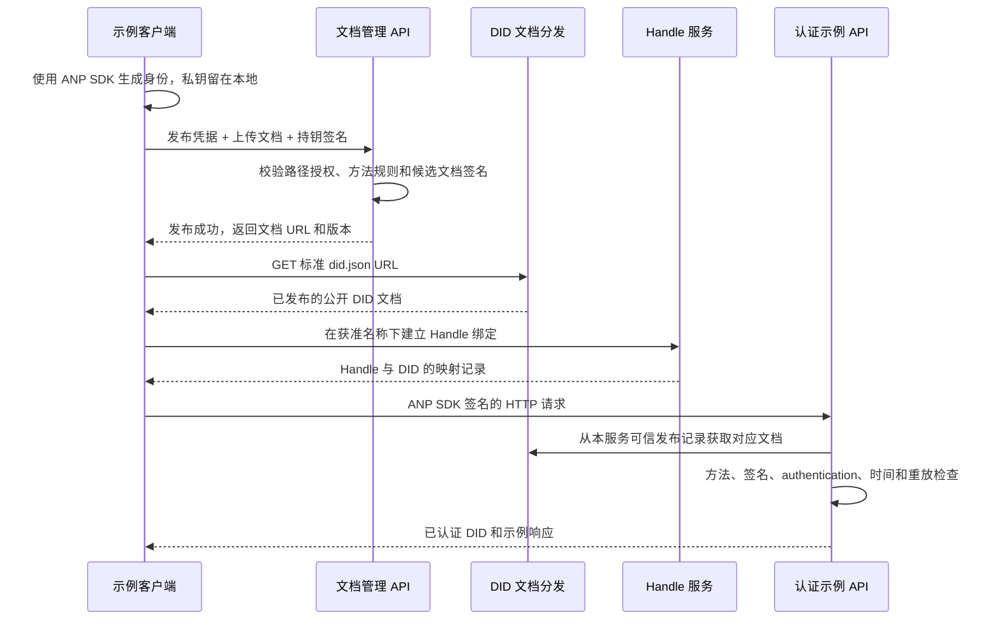

# Open DID Server 项目方案

状态：首版本地实现已完成。正式 HTTPS 验收未执行。

创建日期：2026-10-01。

## 0. 首版实施记录（2026-10-01）

P0 仍以 `458b842` 的方案为准。P1 至 P4 的代码、测试、客户端和部署示例已在本仓库实现，依赖锁定为 PyPI `anp==1.0.5`（registry `https://pypi.org/simple`，wheel `anp-1.0.5-py3-none-any.whl`）。没有修改 ANP SDK。

已在本机用独立数据目录和回环端口执行：

- WBA E1 与 Web 的上传、标准 `did.json` 原文读取、Handle 绑定、whoami 和 echo。
- 稳定主体路径冲突、主机大小写与 `:443` 规范化冲突、proof 被破坏、非 `authentication` 键、发布凭据替换、`If-Match` / `Content-Type` / 正文 / 目标 URL 篡改。
- 重复签名头、参数顺序、时间窗口、重复重放、并发更新、并发重放，以及签名有效期内进程重启后的重放拒绝。
- Handle 的 suspended / revoked、generation、本地 DID 暂停不自动恢复 Handle。
- 受信代理重建 `https://did.example.test/...`，以及 `PUBLIC_DID_PORT=8443` 时 DID 带端口、Handle URL 不带端口。
- 独立客户端进程 `examples/client/run.py`。文档解析使用 `base_url_override`，记录为 development demo。
- 用手写签名基串和固定摘要 `sha-256=:pY6BR0NZSvSfPExR0TrlXPyGrAwda96+tKyvsnJWEpk=:` 验证 echo。该基串不是 `generate_http_signature_headers` 生成的。调换参数顺序后服务返回 401。
- 用旧数据库覆盖已前进的高水位事实后，服务进入维护。等到签名窗口结束，`clear-maintenance` 仍然不会补回丢失的 tombstone、稳定路径或已撤销 grant。只丢掉已消费 nonce、其余事实仍匹配时，同样进入维护。重放截止时间写在高水位文件里，按发现落后的那次时钟计算，比普通维护多一个时钟偏差再加 1 秒。数据库里更早一次维护的开始时间不会提前打开认证，也不会把 `nonce_watermark` 写低；窗口结束后是把数据库水位抬到文件里的值。进程在水位仍超前时再次启动，会把截止时间从新的时钟向前推。
- 正式模式的 WBA HTTPS 解引用发生在绑定事务提交并释放写锁之后。创建和状态更新都能因此读到新 generation。这项顺序由测试中的替身响应证明，不是公网验收。

未执行，不能写成通过：

- 真实公网域名、证书和反向代理上的正式 HTTPS 验收。
- 正式模式下 WBA `exact-handle` 的公网解引用。本地模式只报告 `declaration-consistent` 或 `web-provider-domain`。
- 完整 RFC 9421 互通。首版只接受 api.md 中的单个 `sig1` 形态。

SDK 已核对、由应用层补上的边界：`DidWbaVerifier` 不用于示例接口；`verify_handle_binding` 的成功不报告为 `exact-handle`；线上参数顺序在调用 SDK 验签之前检查。

## 实施记录之后的原文

下面各节保留设计时的规则。和本节冲突时，以本节的验收事实和第 1–9 节的设计规则为准；第 11 节的“当前只创建文档”描述的是 P0 当时的仓库，不是现在的代码布局。

组织：`agent-network-protocol`。

仓库：`open-did-server`。

当前交付：公开仓库与方案文档；本轮补齐设计约束，不编写服务端、客户端或测试代码。

## 1. 项目目标

Open DID Server 是一个开源 DID Server 参考实现，展示如何托管 DID 文档、提供可读名称查询，以及验证使用 ANP SDK 签名的 HTTP 请求。开发者应能通过这个项目理解关键流程，并在自己的域名下运行服务。

用户已确认需要支持的 DID 方法是 `did:wba` 和 `did:web`。名称服务使用 Handle 一词，例如 `alice.example.com`；Handler 通常表示程序中的请求处理函数，不作为这里的协议术语。WebDAV 文件管理协议不在本项目需求范围内。

首版完成以下可观察结果：

1. 客户端在本地生成 DID 文档与密钥，通过 HTTP API 上传公开文档。
2. 服务端校验文档、上传权限与发布位置，并在 DID 方法规定的 URL 分发文档。
3. 提供 Handle → DID 和 DID → Handle 查询，以及与 DID 文档声明一致的双向绑定流程。
4. 示例客户端使用现有 ANP SDK 对真实 HTTP 请求签名；服务端使用 SDK 验证签名，返回已认证 DID。
5. 提供完整的域名与 HTTPS 演示，并争取提供使用 IP 运行的本地演示，不修改 ANP SDK。

## 2. 范围与实现原则

首版采用单实例、单身份托管域名、单 Handle Provider 域名的结构，两者默认相同。启用 WBA Handle 时，启动阶段校验两者的规范化 hostname 相同，配置不满足则拒绝启用该功能。服务端负责公开文档和名称记录；用户的身份私钥始终保留在客户端。

首版认证示例先接受本服务已发布、状态有效的 DID。这样可以完整展示“创建身份 → 上传 → 分发 → 签名请求 → 验签”的流程，也便于无需公网域名的本地演示。接受任意外部 DID 的通用认证服务是后续扩展，不能把本服务的登记记录当成其他域名 DID 的可信来源。

首版不实现钱包、私钥托管、完整账户系统、OAuth/VC 授权、IM/E2EE、跨域名称提供商迁移或自动身份恢复。DID 轮换、恢复和私密 Handle 确认留到后续阶段；首版不通过重新分配旧名称来模拟这些能力。

密码学、指纹计算和 HTTP 签名格式复用 ANP SDK。项目自身承担发布授权、可信文档选择、请求上下文、签名覆盖策略、时效与重放防护；这些应用责任不能省略。

## 3. 已核对的协议与 SDK 基线

本方案依据已读取的本机 SDK 和协议文件设计。以下提交均已确认存在于 GitHub；引用固定提交，避免把未提交修改或其他分支当成设计基线。

| 对象 | 已核对基线 | 相关结论 |
|---|---|---|
| ANP Python SDK | `anp`，提交 `9e8361f131bf422444ae6addca29d36a0845c203`；本地分支 `release/0929` | 支持 WBA/Web 文档解析、HTTP Message Signatures、WNS 数据模型与名称绑定工具 |
| ANP 协议 | `AgentNetworkProtocol`，提交 `262cd4514a25c6f7111b1420f54518506e5972e4` | ANP-02 负责公共请求认证，ANP-03 负责 WBA 方法，ANP-04 负责 Handle/WNS，原生 Web 按 Appendix B 兼容 |
| SDK 项目元数据 | 同一 SDK 提交中的 `pyproject.toml` 标注 `1.0.5` | 实现时仍需核对所选发布制品实际提供的 API，并锁定版本及依赖；源码版本号不替代制品验收 |

### 3.1 可以直接复用的 Python API

| 功能 | SDK 入口 | 本项目用途 |
|---|---|---|
| 新建 WBA 身份 | `create_did_wba_document(..., did_profile="e1", enable_e2ee=False)` | 客户端生成 E1/Ed25519 身份；首版认证示例无需额外 E2EE 键 |
| Web 文档方法校验 | `validate_did_document_method` | 客户端将本地 Ed25519 公钥组装为最小 Web 文档，再交给 SDK 校验与签名 |
| 可选 Web 多设备构建 | `build_web_did_document` | 该构建器要求设备描述和签名/密钥交换公钥；不作为首版单键 HTTP 认证的前提 |
| 方法校验 | `validate_did_document_method` | 校验方法规则；活动 WBA E1 文档必须通过 proof 校验，Web 仍需应用层结构和关系校验 |
| 解析文档 | `resolve_did_document` | 对外解析示例；显式本地配置可使用 `base_url_override` |
| HTTP 请求签名 | `generate_http_signature_headers`、`DIDWbaAuthHeader` | 生成 `Signature-Input`、`Signature` 和有请求体时的 `Content-Digest` |
| HTTP 签名验证 | `extract_signature_metadata`、`verify_http_message_signature` | 从可信文档验证实际请求签名；外层补齐授权、覆盖范围、时效和重放检查 |
| 高层认证验证 | `DidWbaVerifier`、`DidWbaVerifierConfig` | 展示标准域名解析路径的现有用法；不能直接假定它可注入本地解析地址 |
| Handle/WNS | `validate_handle`、`normalize_handle`、`resolve_handle`、`build_handle_service_entry` | 名称规范化、正向查询及 DID 服务声明 |

### 3.2 需要明确的 SDK 边界

- 当前 `did:wba` 创建函数拒绝 IP hostname；ANP-03 明确禁止 DID 标识符中包含 IP。
- 旧 `create_did_wba_document_with_key_binding` 已废弃并转发到 K1 兼容 profile，不能用它生成默认 E1 身份；首版显式调用 `create_did_wba_document` 的 E1 profile。
- 当前 `did:web` URL 构造器要求 DNS hostname，拒绝 IP literal。正式解析要求公共 HTTPS、TLS 校验及准确的文档 `id`。
- `validate_did_document_method` 的 Web 分支主要检查 DID 对应的 URL 能否合法构造，不验证完整的键结构、用途、归属与服务关系，不能替代上传校验。
- `resolve_did_document(..., base_url_override=...)` 可把域名 DID 对应的资源请求发送到显式配置的本地 HTTP/IP 地址。这个参数改变传输位置，不改变 DID 的合法标识符。
- 当前 `DidWbaVerifier` 内部直接选择 WBA/Web 解析函数，配置中没有 `base_url_override` 或通用解析器注入入口。因此底层解析器支持覆盖地址，不代表高层验签器可以直接使用该参数。
- `verify_http_message_signature` 检查签名和摘要，但不能单独替代应用层认证策略。当前实现可从 `verificationMethod` 找到一个没有被 `authentication` 授权的键，也不独立强制所有必要签名组件或检查完整时间窗口和重放状态。
- 已核对的 WNS `verify_handle_binding` 使用正向记录和 Provider 域名声明完成校验；不能仅凭该工具的成功布尔值宣称已满足新版 WBA `exact-handle` 的端点解引用要求。项目的演示需明确实际执行了哪些检查。
- 该 WNS 工具在 WBA 分支直接比较 DID authority 原文和 Handle 域，不能正确比较带编码端口的 authority。项目按第 5.1 节解析 hostname，自行执行 WBA 精确端点流程，不修改 SDK，也不因此禁止规范允许的非默认端口。

### 3.3 首版 HTTP 签名支持范围

当前 SDK 使用有限的 `Signature-Input` 解析逻辑，重建签名参数时固定处理 `created`、`expires`、`nonce`、`keyid`。它不是完整 RFC 9421 结构化字段与所有签名变体的通用实现。首版只接受下面的明确格式；不支持的合法 RFC 变体也返回清晰错误，不能静默忽略参数：

- 每个请求只接受一条 `Signature-Input` 和一条 `Signature`，且仅有 `sig1` 这一签名标签。在转为字典前检查原始 HTTP Headers，拒绝重复关键头、重复组件、重复参数、多签名和逗号组合形式。
- 参数采用 SDK 生成的固定次序 `created`、`expires`、`nonce`、`keyid`，不接受额外参数（包括首版不用的 `alg`、`tag`），不接受组件参数或转义字符串变体。固定 nonce 为 SDK 默认生成的 32 位小写十六进制随机值；时间参数为无前导零的十进制整数。
- `keyid` 必须是完整的获支持 DID URL，fragment 非空且仅含首版允许的 URI 字符；不能包含空白、控制字符、引号或未编码分隔符。SDK 生成请求与服务端严格检查使用同一已文档化格式。
- 组件名称、顺序和允许集合按第 8.2 节的接口策略确定；额外组件不能被忽略后当作“已签名”。`Signature` 使用规范 Base64 编码的 64 字节 Ed25519 签名；`Content-Digest` 只接受单一规范 `sha-256` 值。
- 上传文档内部的验证方法 ID、用途引用、服务 ID 统一要求完整 DID URL。WBA 规范允许同文档相对引用，但首版在上传边界明确拒绝，返回 `unsupported_relative_did_url`；不改写客户端原文或 proof。客户端调用 SDK 构建器时使用 `#handle` 参数可以，最终生成的上传文档必须已展开。

这限定的是本参考实现的支持范围，不改变 ANP/RFC/DID 的协议能力。应用先校验完整原始输入及上述格式，再调用 SDK 提取元数据和验签，不能仅依赖已经丢失重复项的解析字典判断输入安全。严格入口必须验证完整语法和规范序列化一致性，不能只在 SDK 宽松解析后增加几个字段白名单。

首版同时规划 SDK 客户端闭环和独立构造的固定签名向量。独立向量的预期签名基串、摘要与结果不能由待验证的同一 SDK 再生成。完整 RFC 9421 实现互通是单独的后续能力，不以首版闭环通过代替。

这些是代码与文档检查结论，本次没有运行 SDK 或互通测试。

## 4. 建议技术方案

首版建议采用 Python 3.11+、FastAPI、Uvicorn、ANP Python SDK 和 SQLite，通过 UV 管理依赖。选择 Python 是为了直接复用现有 SDK 的身份构建、签名、验签和 WNS 能力，并减少示例阅读成本。这些是后续开发的建议默认值，本次不生成依赖文件或安装运行环境。

使用一个服务进程提供三个模块：

- 文档管理与分发：校验、首次发布、更新和标准 DID 文档读取。
- Handle 服务：名称预留、绑定、正向解析和反向查询。
- 认证示例：读取可信文档并验证 SDK 签名请求。

SQLite 保存文档正文、发布位置、归属、版本与名称状态。文档和相关索引在事务中更新，避免数据库和文件系统双写不同步。HTTP 分发直接读取已提交的数据；无需把用户输入直接拼成磁盘路径。

示意流程：



## 5. DID 文档发布与 HTTP 分发

### 5.1 标识符与资源 URL

文档 `id` 必须与请求登记的 DID 完全一致。发布 authority 必须属于配置的托管域名和端口；API 不为不受本服务控制的外部域名提供“权威发布”。

建议默认将两种方法放在不同路径，避免占用相同 URL：

| 方法 | DID 示例 | 标准文档 URL |
|---|---|---|
| WBA E1 路径身份 | `did:wba:example.com:identities:wba:alice:e1_<fingerprint>` | `https://example.com/identities/wba/alice/e1_<fingerprint>/did.json` |
| Web 路径身份 | `did:web:example.com:identities:web:bob` | `https://example.com/identities/web/bob/did.json` |
| WBA 根身份 | `did:wba:example.com` | `https://example.com/.well-known/did.json` |
| Web 根身份 | `did:web:example.com` | `https://example.com/.well-known/did.json` |

`<fingerprint>` 是说明用占位符，真实 E1 指纹必须由 SDK 从绑定公钥生成。

WBA 与 Web 的根身份，以及拥有相同 authority 和路径的两种 DID，会映射到同一个资源 URL，但一份 DID 文档只能有一个确定的 `id`。首版默认使用隔离的路径身份；根身份由管理员显式选一种方法启用。对整个 canonical URL 建立唯一约束，遇到冲突返回 `409`，不能按请求 Header 返回不同身份的文档。

canonical URL 是项目用于分发索引、权限和冲突判断的统一资源键，不直接沿用某一 SDK 分支输出的字符串。两种方法共用以下规则：

1. 严格解析 DID authority，校验 DNS hostname 与可选端口；hostname 转小写，HTTPS 默认端口 `443` 从资源键中移除，其他端口转为规范十进制。拒绝尾点、用户信息、IP、非法编码及歧义 authority。
2. 路径按 DID 段逐段严格解码一次，再使用 UTF-8 和固定 percent-encoding 规则编码；保留路径大小写，不把不同大小写路径合并。拒绝空段、点段、分隔符、控制字符和需要二次解码的 `%` 残留。
3. 管理 API 的登记、发布授权匹配、稳定主体路径、分发查找和数据库唯一约束使用同一解析结果。原始 DID 与文档 `id` 保留原值且必须准确匹配；不能通过改写 `id` 修复大小写、编码或端口别名。
4. 因此 `Example.com` / `example.com`、显式 `443` / 省略端口、等价的路径编码，即便原始 DID 不同，也不能占用同一资源发布不同文档。

WBA E1 另行登记稳定主体路径：规范化 hostname、有效端口及最后指纹之前的完整路径。它的归属不随 DID 指纹变化而改变；完整 DID 或 URL 唯一并不能保护这一层。首版将每条稳定路径永久分配给 `owner_id`，且只接受最初登记的一个 DID；另一个指纹即使由同一 owner 提交，也返回 `409 stable_subject_path_reserved`，不能作为新的首次登记绕过尚未实现的轮换流程。路径归属与文档发布在同一事务中创建，暂停或停用后仍保留，不删除或重新分配。

### 5.2 上传与更新规则

上传只接收 JSON DID 文档，不接收私钥。最小校验要求：

1. 限制正文大小为 1 MiB，要求 JSON 对象，拒绝重复字段和已知私钥字段（例如 JWK 的 `d`、私钥 PEM）。
2. 仅接受 `did:wba`、`did:web`，核对 `id`、authority、受授权的 canonical 路径和托管域名。
3. 验证公钥编码、验证方法唯一性、绝对 DID URL 引用与 `controller` 关系；用于认证的键必须由该文档的 `authentication` 授权。Web 方法校验通过不能跳过这些检查。
4. 新建 WBA 路径身份默认使用 E1，验证路径指纹与绑定公钥，按 ANP-03 校验文档 proof；原生 Web 不套用 WBA 指纹规则。
5. 对更新的 WBA 文档继续保持绑定规则；变更绑定根键会产生新 DID，首版不将其作为同一 DID 的普通更新接受。
6. 对 URI/path 做明确解析，拒绝空段、`.`、`..`、控制字符、编码后的分隔符和二次解码歧义；保留 API、健康检查与名称服务路径。
7. 保存客户端提交的公开字段与 proof。Handle 服务声明由客户端在签名前加入文档，服务器不能事后修改带签名文档来“补齐”声明。
8. 对已有 `active` Handle 的文档更新，必须保留该方法所要求的服务声明，否则返回 `409 active_handle_declaration_conflict`。WBA 保留对应精确标准入口；Web 保留有效 HTTPS Provider 域名声明，不强制升级为 WBA 的精确路径规则。移除声明前先暂停或撤销 Handle；恢复名称时重新检查。

首版 Web 客户端的最小格式固定如下，这是一种 SDK 已支持的选择，不表示 SDK 仅支持这一种键类型：

| 字段 | 示例格式与校验 |
|---|---|
| `@context` | 客户端示例使用 `https://www.w3.org/ns/did/v1` 和 `https://w3id.org/security/suites/jws-2020/v1`，明确采用 JSON-LD 表示；DID Core 的普通 JSON 表示不统一要求 `@context` |
| `id` | 完整 Web DID，与发布位置和查询对象准确一致 |
| `verificationMethod[].id` | 完整 DID URL，例如 `did:web:example.com:identities:web:bob#key-1` |
| `verificationMethod[].type` | 示例固定为 `JsonWebKey2020`；当前 SDK 也支持其他已列明的键类型，并非只能使用 JWK |
| `verificationMethod[].controller` | 与文档根 `id` 完全一致 |
| `publicKeyJwk` | `kty=OKP`、`crv=Ed25519`、`x` 为规范无 padding 的 Base64URL 编码 32 字节公钥，不含 `d`；不同时放入其他公钥材料字段 |
| `authentication` | 非空，引用上述完整验证方法 ID；请求的 `keyid` 也必须使用完整 ID |

服务端首版上传支持 SDK 生成的 WBA E1/Multikey 和上述 Web/Ed25519 JWK 格式；其他算法或材料格式返回明确不支持错误。JSON-LD 示例的所需上下文采用已知固定集合，避免把上传校验变成任意外部上下文抓取。

### 5.3 首次发布的授权与认证引导

新文档尚未发布时，不能要求服务端先通过公开 URL 解析这个 DID，否则会形成循环依赖。

首版使用显式配置的发布凭据引导，默认只适用于开发者自己运行的实例。凭据授权具体托管路径与可分配名称；示例运行时使用独立、随机生成的凭据，不内置公共默认口令。

后续实现提供本地管理命令初始化数据库并创建/撤销发布 grant，明确登记 `owner_id`、允许的规范化稳定路径或 Web 发布路径、Handle 名称与有效期。随机凭据只在创建时交给管理员一次，数据库保存摘要；用户无需手动修改 SQLite。该入口也负责本地认证状态管理，首版不新增完整账户后台。

所有文档和 Handle 写接口通过独立 `ANP-Publication-Token` Header 接收发布/名称管理凭据，并要求签名覆盖该 Header。它不是 ANP 访问令牌，不放进 `Authorization: Bearer`；客户端显式选择 SDK HTTP 签名入口。示例验签接口不读取此凭据、不接受它代替 DID 签名；首版不接受 Bearer 或旧 DIDWba 认证模式。

首次发布需要同时满足：发布凭据允许写入该位置，以及客户端使用候选文档中的 `authentication` 公钥对应私钥对上传请求签名。候选文档只在这个受约束的首次发布流程中用于持钥校验，不能因此获得其他账户、路径或 Handle 的权限。SDK 负责密码学验证；应用检查候选文档的方法规则和签名策略。

后续更新使用当前已发布文档的认证键校验请求，再检查活跃 grant 的范围、`owner_id` 与已登记的发布归属一致。不能改为信任更新正文中新塞入的键。更新要求签名覆盖 `If-Match`；凭据持有者的管理能力独立于“签名有效”，两者不能混为一谈。

首次发布在同一提交事务中登记资源 URL、DID、稳定主体路径归属和发布记录。后续写操作在提交事务中重新确认验签依据的文档版本、本地认证状态、grant 有效性及 owner 未变化，再比较 `If-Match` 并执行操作。事务外验签后若相关版本变化，失败并要求客户端重新读取、重新签名，不能按已经失效的键权限继续提交。

多用户公开托管需要独立的登记、邀请或账户授权策略，留到后续阶段。首版“用户可以上传”指持有获准发布凭据的使用者，不提供匿名任意覆盖。

### 5.4 分发行为

- `GET` / `HEAD` 返回公开 DID 文档，支持 `application/did+json`，并兼容 `application/json` 客户端。
- 使用 `ETag` 和 `If-None-Match` 返回 `304`；首版采用较短缓存时间，更新后使用新的 ETag。
- 未发布资源返回 `404`；不返回默认身份文档，不自动重定向到另一个 DID。
- 发布记录是认证示例的可信来源，不能从请求正文或任意 `did_document_url` 替换。
- 正式部署以 HTTPS 和实际域名为准；本地 HTTP 输出明确标为开发演示。

### 5.5 DID 方法状态与本地状态

三类状态分别处理，不能互相替代：

| 状态类别 | 首版规则 |
|---|---|
| WBA 方法状态 | 新建和更新只接受活动文档；`deactivated` 若存在必须为布尔 `false`，`true` 或 `successorDid` 返回 `422 unsupported_did_lifecycle`。尚未实现的迁移文档不能进入活动认证路径；已有/导入记录即使绕过上传检查也在认证时再次拒绝 |
| 本地认证状态 | 发布记录保存 `local_auth_status=active/suspended` 与记录版本；由本地管理命令变更。`suspended` 禁止该 DID 在本实例中的新认证、文档写入和身份依赖的名称管理；普通公开文档仍可分发，不宣称是全网 DID 撤销 |
| Handle 状态 | 按第 6.3 节管理名称；Handle 暂停或撤销不会自动停用 DID，与本地 DID 暂停的联动只按下一段的事务规则发生 |

原生 Web 不套用 WBA 的迁移字段；首版上传同样拒绝这些尚未支持的顶层生命周期扩展。`alsoKnownAs` 等别名字段不构成连续性或权限证据。

本地认证暂停在同一事务中将依赖该 DID 的活动 Handle 转为 `suspended` 并增加 generation，记录暂停原因。恢复 DID 的本地认证状态后，Handle 仍保持 suspended，需重新通过声明、版本与权限检查才能恢复。运营者管理路径允许暂停不可认证的身份，不能要求被暂停身份先完成业务认证。

## 6. Handle → DID 与 DID → Handle

### 6.1 名称与记录

名称格式遵循 WNS：`{local-part}.{provider-domain}`，例如 `alice.example.com`。规范化为小写，复用 SDK 格式检查，同时保留协议/系统/防混淆名称。Handle 不含端口，即便对应 DID 的 authority 含有编码端口。

每个 Handle 当前对应一个 DID，首版也对 DID 的当前 Handle 建立唯一约束。已分配名称保留同一归属；撤销后保存永久 tombstone，不重新分配给另一主体。

正向入口：`GET /.well-known/handle/{local-part}`。示例记录：

```json
{
  "handle": "alice.example.com",
  "did": "did:wba:example.com:identities:wba:alice:e1_<fingerprint>",
  "status": "active",
  "binding_generation": "1",
  "updated": "2026-10-01T00:00:00Z",
  "ttl": 60
}
```

`binding_generation` 是无符号、无空白、无前导零的正十进制字符串，例如 `"1"`、`"12"`；`"0"`、`"01"`、数值 `1` 均无效。每次实际 DID 绑定或状态变化都在事务中严格递增，不能用时间戳代替，也不能因重启、导入或备份恢复而任意重置。初次绑定从 `"1"` 开始；没有实际状态变化的幂等操作不增加 generation。

反向入口：`GET /api/v1/handles/by-did?did={urlencoded-did}`，根据本服务的索引返回对应的公开 Handle 记录。它是本项目的便利查询 API，不宣称是 WNS 新增的标准解析入口，也不自动构成双向绑定证明。

首版仅支持公开 Handle。WNS 可选的私密 DID Confirmation Endpoint 不在首版内，不能在私密确认响应中暴露 Handle 来充当反向查询。

### 6.2 与 DID 文档的双向声明

客户端在上传前加入以下公开服务声明：

```json
{
  "id": "did:wba:example.com:identities:wba:alice:e1_<fingerprint>#handle",
  "type": "ANPHandleService",
  "serviceEndpoint": "https://example.com/.well-known/handle/alice"
}
```

对 WBA 公共 Handle，演示需按 ANP-04 校验：正向记录处于 `active`、DID 方法有效、DID hostname 与 Handle Provider 一致、文档中存在对应 HTTPS 声明，并实际请求声明的精确标准入口，核对返回的 Handle 和 DID。只有这些检查完成后才能报告 `exact-handle`。

对原生 Web，遵循 Appendix B.4 的既有兼容模型：正向记录对应准确的 Web DID，DID 文档声明 HTTPS Handle Provider 域名。Web 身份域名可以与 Provider 不同，但首版上传仍仅限本实例托管域名。演示标明这是 Web Provider 域名声明兼容检查，不提升为 WBA 的 `exact-handle` 或私密 `provider-confirmed` 结果。

建立绑定时，WBA 声明必须是该 local-part 的精确标准入口，而不是同域名下任意另一用户的路径。Web 仅按自身的 Provider 域名规则检查。两者都读取已发布文档的版本；创建/恢复提交时在同一事务中确认文档版本、身份状态和名称授权未变。文档更新若仍保留符合要求的声明，则在同一事务中更新关联绑定的已核对文档版本；不允许出现活动绑定只检查过旧文档的情况。

首次上传仅检查声明格式、域名和获准目标路径，不要求尚未登记的 Handle 入口已经返回 active。名称提交后，域名模式的演示客户端再执行公开 HTTPS 正向与反向验证。网络验证不放在数据库事务内；结果关联所观察的文档版本和 generation，状态变化后不能沿用旧验证结果。

这里所说的实际 HTTPS 声明校验需要域名运行模式。本地 HTTP/IP 模式可以演示名称记录与查询，但不报告完成生产环境的 HTTPS 双向绑定验证。

### 6.3 状态与绑定管理

公开查询固定如下，便于现有 SDK 分辨暂停与不存在：

| 状态 | 正向/反向查询 | 可否作为活动绑定使用 |
|---|---|---|
| `active` | `200`，返回包含该状态和 generation 的记录 | 仍需按方法完成绑定验证 |
| `suspended` | `200`，明确返回 `status=suspended`，保留归属与 generation | 否；不能用 `404` 隐藏成从未注册 |
| `revoked` | `410`，保留永久 tombstone | 否，不能恢复 |
| 从未登记 | `404` | 否 |

允许的状态转换为 `active → suspended/revoked`、`suspended → active/revoked`；`revoked` 是终态，同一 owner 也不能重新激活。相同状态的重复写入仅在当前版本、权限和签名检查均成功时按幂等操作处理，不更新 generation；旧 `If-Match` 仍返回 `412`。

创建绑定需要名称分配授权、目标 DID 的有效认证，以及目标公开文档中的服务声明。后续状态管理同时检查账户/发布归属和签名身份。首版不开放将一个既有 Handle 重绑到另一 DID；同一主体的 DID 轮换需要后续实现 ANP-03 连续性、ANP-04 generation 和恢复策略后再启用。

### 6.4 备份恢复与单调性

SQLite 事务提供一次写入的一致性，不能证明数据库没有被恢复到旧快照。恢复旧快照可能同时回退 generation、名称历史、tombstone、稳定主体路径归属、已撤销 grant 和有效期内的重放记录。

部署说明要求保留最新数据库及可靠的完整写入历史，恢复时对照此前最高 generation、永久归属、tombstone 和 grant 撤销状态；不能把一个旧快照直接作为同一 Provider 的最新状态上线。首版不建设分布式日志，但恢复入口必须有显式维护状态：无法证明记录完整时，相关名称/写接口停止正常服务并返回 `503`，不能以低 generation 或 `404` 冒充正常状态。

对于有效期内的 nonce 记录也按同样原则处理；若无法恢复，保持维护状态至少经过最长签名有效窗口及允许的时钟偏差后，再结合其他状态的完整性确认恢复认证。单纯等待不能修复永久名称或路径归属证据缺失。

## 7. HTTP API 草案

以下是首版接口建议，开发前需据此冻结字段与状态码。路径中 `document-id` 是服务端记录 ID，不是直接拼接未经解析的 DID 字符串。

| 方法与路径 | 用途 | 访问条件 |
|---|---|---|
| `GET /healthz` | 进程健康信息 | 公开，返回精简信息 |
| `POST /api/v1/did-documents` | 首次上传并发布，正文为 DID 文档 | 获准发布凭据 + 候选文档持钥签名 |
| `GET /api/v1/did-documents/{document-id}` | 查询公开文档和发布元数据 | 公开，仅含公开字段 |
| `PUT /api/v1/did-documents/{document-id}` | 更新同一 DID 的文档 | 当前公开文档认证键 + 活跃发布 grant/归属 + 签名覆盖的 `If-Match` |
| `GET/HEAD /.well-known/did.json` | 分发显式启用的根身份 | 公开 |
| `GET/HEAD /{registered-path}/did.json` | 分发已登记的路径 DID | 公开，限定于 canonical 发布索引 |
| `PUT /api/v1/handles/{local-part}` | 首次绑定，或同一绑定的状态管理 | 活跃名称 grant + 目标 DID 认证 + `If-Match`（更新） |
| `GET /.well-known/handle/{local-part}` | 标准 Handle → DID 查询 | 公开 |
| `GET /api/v1/handles/by-did?did=...` | 本实例 DID → Handle 查询 | 公开，首版仅公开名称 |
| `GET /examples/auth/whoami` | 演示无正文的签名请求 | ANP HTTP Message Signature |
| `POST /examples/auth/echo` | 演示请求正文完整性和签名验证 | ANP HTTP Message Signature |

首次发布成功返回 `201`，包含 `document_id`、`did`、`document_url` 和版本/ETag。格式错误返回 `400` 或 `422`，正文超限返回 `413`，资源冲突返回 `409`，缺少更新前提返回 `428`，版本冲突返回 `412`。

文档管理资源和 Handle 资源各自使用强 ETag，更新要求准确的单个版本值，不接受 `If-Match: *` 代替读取版本。管理 ETag 对应包含认证/授权相关状态的记录版本；公开 `did.json` 的内容 ETag 可独立按公开正文生成。首次 Handle `PUT` 是 create-only；没有 `If-Match` 时遇到既有记录返回 `409`，不转为隐式更新。更新漏带条件返回 `428`，条件存在但未按签名策略覆盖则返回认证失败。

认证缺失、未知/不被 `authentication` 授权的键、签名/摘要错误、过期或重放返回 `401`；认证完整通过后缺少发布或名称权限，或被本地访问策略禁止时返回 `403`。应用按 ANP-02 分类，不直接复制高层 SDK 对键用途失败返回 `403` 的实现行为。WBA 方法生命周期错误仍按方法规则单独处理，不能泛化为授权失败。

`401` 同时返回 `WWW-Authenticate: DIDWba`，使用 ANP-02 的 `invalid_request`、`invalid_did`、`invalid_verification_method`、`invalid_signature`、`invalid_content_digest`、`invalid_timestamp`、`invalid_nonce` 分类，以及 `Cache-Control: no-store`。`DIDWba` 这一挑战名称也用于 Web 的公共认证流程，不表示 Web 被转换为 WBA。可附 `Accept-Signature` 描述该端点的覆盖要求。首版采用客户端随机 nonce 的直接签名模式，不发送一个没有实现消费逻辑的服务器 nonce。

错误体保留稳定的 `error` 和可读 `message`，Header 和 JSON 表达同一原因，不返回密钥、令牌或内部异常堆栈。发布凭据缺失/撤销/越权在 DID 认证完成后返回 `403`，不能因为凭据有效跳过签名。暂停身份在签名有效性可确认后返回本地禁止访问结果，业务和写事务不得继续。

首版认证示例每次都签名，不要求 Bearer/JWT 交换。上传用的发布凭据只负责发布授权，不是验证 DID 请求后发出的通用访问令牌。

## 8. 请求签名与服务端验签示例

### 8.1 客户端流程

示例客户端提供明确的 WBA 和 Web 选项，流程如下：

1. 使用本地管理入口初始化并领取获准发布参数，读取目标服务地址、公开 DID 域名和预留名称。
2. WBA 创建时将服务条目通过 `services` 一起传入，条目 `id` 使用 `#handle`；SDK 在得到最终指纹 DID 后将它展开，并在生成 E1 proof 前加入文档。调用 `create_did_wba_document(..., services=[...], did_profile="e1", enable_e2ee=False)`，不能先生成文档再无签名地追加 Handle 服务。
3. Web 使用标准 `cryptography` 库生成 Ed25519 密钥，按第 5.2 节的最小格式构建文档，再加入完整服务 ID 与声明。两种身份均使用 ANP SDK 方法校验和 HTTP 签名；密钥留在本地忽略目录，不上传私钥。Web 单键示例无需多设备构建器。
4. 按实际 HTTP method、完整目标 URL 和将发送的原始正文 bytes 生成上传签名，并发送发布凭据。
5. GET 标准文档 URL，确认发布成功且返回准确 `id`。
6. 建立 Handle 绑定，执行正向、反向查询；域名模式下执行对应绑定验证。
7. 使用 `generate_http_signature_headers` 对 `GET /examples/auth/whoami` 和 `POST /examples/auth/echo` 签名；发送与签名时完全相同的 URL、Headers 和正文 bytes。
8. 展示服务端返回的已认证 DID、认证方式和示例业务数据；失败时展示明确错误。

上传或更新 WBA E1 文档的任何字段后，客户端必须使用 SDK `generate_w3c_proof` 对去掉旧 proof 的最终文档重新签名，显式选择 `proof_type="DataIntegrityProof"`、`cryptosuite="eddsa-jcs-2022"`、`proof_purpose="assertionMethod"` 及对应 E1 绑定键的完整验证方法 ID。该函数的 Ed25519 默认 proof 类型不是这个 E1 profile，不能省略类型/套件选择。保持绑定 proof 键与 `assertionMethod` 授权；服务器不能替用户重签。文档 proof 与 HTTP 请求签名是两个独立步骤，后者不能弥补前者失效。

写请求使用 `generate_http_signature_headers` 的 `covered_components` 显式设置第 8.2 节的覆盖集合，并传入实际的 `Content-Type`、`If-Match`（更新）及 `ANP-Publication-Token`。SDK 返回签名/摘要头，客户端还必须合并发送原始业务 Header；不能只发送函数返回值而漏掉已签名的前提条件。

`DIDWbaAuthHeader` 的当前高层接口不能直接指定这些额外组件，首版仅可用于默认覆盖形态符合要求的无正文示例，并使用 `force_new=True` 避免缓存 Bearer。写接口直接使用底层公开签名函数，不为此修改 SDK。默认演示现代 HTTP Message Signatures；旧 `Authorization: DIDWba ...` 模式不在首版内。

### 8.2 服务端流程

采用项目自己的薄认证适配层，调用 SDK 公开函数，不改动 SDK 源码或 monkey-patch 高层验证器：

1. 在 JSON 解析和 Header 字典化前获取请求原始 bytes 与 Header 列表，按第 3.3 节拒绝重复、未知或歧义签名格式。
2. 提取完整 `keyid`，严格解析 DID 和 fragment；只从当前已发布且归属于本服务的记录选取文档，记录其版本和本地认证状态。首次发布使用第 5.3 节限定的独立引导路径。
3. 核对文档 `id`，执行方法规则、WBA proof 与生命周期检查；不将方法校验返回 True 当作完整结构验证。
4. 确认 `keyid` 由该 DID 的 `authentication` 授权，且键的归属和用途符合规则；仅在 `verificationMethod` 或 `assertionMethod` 中存在不足以认证，返回 `401 invalid_verification_method`。
5. 按下表强制签名覆盖，检查组件的唯一性、大小写和固定顺序。签名未覆盖 `If-Match` 时不能只靠版本比较补救。
6. 调用 `verify_http_message_signature`，使用真实 method、完整 URL、Headers 和原始 bytes 验证签名和摘要。
7. 要求整数 `created`、`expires`、规定格式的 nonce；`expires > created` 且签名寿命不超过 300 秒，允许时钟偏差 30 秒。拒绝超出窗口的过去/未来请求，重放记录保留到完整有效窗口结束。
8. 同一提交事务重新检查文档版本、方法/本地状态、grant 与归属、`If-Match`、相关 Handle 声明和 generation。条件未变化才执行原子 nonce 消费及业务决策；并发同一签名最多一次进入业务。

固定覆盖集合按下列顺序使用。所有例子均加入 SDK 默认的 `@authority`，并把影响写入语义的 Header 明确纳入：

| 接口类别 | 签名组件（顺序固定） |
|---|---|
| `GET /examples/auth/whoami` | `@method`、`@target-uri`、`@authority` |
| `POST /examples/auth/echo` | `@method`、`@target-uri`、`@authority`、`content-digest`、`content-type` |
| 文档首次发布、Handle 首次绑定 | 上述 JSON POST 集合，再加 `anp-publication-token` |
| 文档更新、Handle 状态更新 | 上述 JSON POST 集合，再加 `if-match`、`anp-publication-token` |

写接口只接受非空 JSON 正文和明确的 `Content-Type: application/json`。不接受先按另一 Content-Type 签名、提交时再切换解析语义。`If-Match` 要求强、准确、单个 ETag；正文、Header 与目标 URL 的签名验证均以实际传输值为准。

nonce 消费与业务决策在同一数据库事务中完成。有效认证请求即使业务层返回 `403` 或 `412`，其 nonce 仍记为已消费；失败请求也不能拿同一签名换一个业务结果。事务级存储失败不得执行业务，返回明确失败；客户端重新读取状态并重新签名，不依赖重发旧签名完成写操作。

HTTPS 反向代理终止 TLS 时，服务端重建的外部 URL 必须与客户端签名目标一致。只信任显式允许的代理；直接请求不能靠伪造 `Forwarded` 或 `X-Forwarded-*` 影响目标 URL、authority 和权限判断。

重放状态写入 SQLite 并使用唯一约束及事务，保留有效窗口内的记录以覆盖进程重启；首版无需引入 Redis。若部署多副本，需要共享原子重放存储和并发发布控制，不能只复制内存缓存。

### 8.3 外部 DID 的后续扩展

后续可增加受控的外部解析适配器，并复用同一签名策略。开启前必须补齐 URL 规范化、非公网地址拒绝、DNS 重绑定防护、重定向策略、超时和响应大小限制，特别不能假定 WBA 的网络解析与 Web 分支已有完全相同的边界。

解析成功只证明相应 DID 方法的可信文档和签名身份，仍不授予本服务的发布、账户或 Handle 权限。

## 9. IP 与本地运行策略

“程序可以通过 IP 运行”与“DID 的 authority 是 IP”是两个不同条件。

| 模式 | 请求或文档传输地址 | DID 标识符 | 预期用途 |
|---|---|---|---|
| 域名正式模式 | 实际域名 + HTTPS | 合法域名 WBA/Web DID | 标准解析、真实签名验签和 Handle 绑定验证 |
| 本地 IP 演示 | `http://127.0.0.1:8000` 或显式配置的开发 IP | 例如 `did:web:example.test:identities:web:bob`，仍使用域名 | 演示上传、公开读取、本实例签名验签和名称查询 |
| IP 直接作为 DID authority | 例如 `did:wba:127.0.0.1:...` | 当前规范/SDK 不接受 | 不纳入首版，不为此修改 SDK |

本地模式中，客户端对真正发送的 IP URL 签名，服务端也以该 URL 验签。服务端从本服务发布记录读取可信域名 DID 文档，不要求对该文档做公网 DNS 解析。客户端若演示 SDK 文档解析，可在显式开发配置中使用 `base_url_override="http://127.0.0.1:8000"`，文档路径与 `id` 保持不变。

本地模式默认绑定 `127.0.0.1`，只使用本次创建的测试身份与测试发布凭据。局域网访问需显式指定监听地址，不因 `LOCAL_DEMO_MODE` 自动监听 `0.0.0.0`；开发 HTTP 模式不复用正式身份或正式发布凭据。DID authority 仍使用域名；HTTP 监听端口 `8000` 不要求写入 DID authority。

建议配置明确区分 `PUBLIC_DID_DOMAIN`、`HANDLE_PROVIDER_DOMAIN`、`REQUEST_BASE_URL`、`LOCAL_DEMO_MODE` 和开发模式的 `DID_RESOLUTION_BASE_URL_OVERRIDE`。这里只定义配置语义，具体配置文件在开发阶段实现。

覆盖地址仅来自运维/开发配置，不能由外部请求、DID 文档或 Handle 记录指定。正式模式拒绝本地 HTTP 覆盖，保持 TLS 校验。不要用关闭全局证书校验来伪装正式解析。

本地 IP 演示已用回环 HTTP 和合法域名 DID 执行。客户端对 `http://127.0.0.1:端口` 签名，并用显式 `base_url_override` 解析，结果标记为 development demo。正式 HTTPS 验收没有执行。实现阶段没有发现必须修改 SDK 才能完成这一本地路径的缺口。

## 10. 数据模型与持久化

| 记录 | 建议关键字段 | 必要约束 |
|---|---|---|
| `did_documents` | `document_id`、`did`、`method`、`canonical_url`、`owner_id`、`document_json`、`local_auth_status`、`record_version`、公开内容 ETag、时间字段 | DID 与规范化 URL 唯一；保留公开文档与本地状态的区别；写入重查验签版本、状态与权限 |
| `stable_subject_paths` | 规范化稳定主体路径、`owner_id`、`current_did`、分配时间 | 稳定路径唯一且归属永久保留；首版不接受同路径第二个指纹 DID；与首次发布同事务登记 |
| `handle_bindings` | `handle`、`local_part`、`provider_domain`、`did`、`owner_id`、`status`、`binding_generation`、`record_version`、`validated_document_version`、暂停原因、时间字段 | 名称和当前 DID 唯一；generation 无前导零；状态机与文档声明在事务中一致 |
| `handle_history` | Handle、旧/新状态、对应 generation、时间字段 | 保存不可重新分配的归属和 revoked tombstone；保留单调性证据 |
| `publication_grants` | 凭据摘要、允许的规范化稳定路径/Web 发布位置/名称、归属、有效期、撤销状态、记录版本 | 本地入口创建/撤销；不保存明文凭据；授权范围不能从上传文档自声明获得 |
| `used_nonces` | `keyid`、`nonce`、失效时间 | 复合唯一约束；有效窗口内持久保留；验证成功后的原子消费 |

这些是逻辑记录，不强制一开始建立通用 ORM 或插件式存储层。数据目录不进入 Git；导出公开文档与备份含凭据摘要的数据库应使用不同操作。

## 11. 仓库布局

P0 当时只有 `README.md`、`LICENSE`、`.gitignore` 与 `docs/plan.md`。首版代码已经落地，模块按职责放在 `src/open_did_server/`（`app.py`、`service.py`、`signatures.py`、`documents.py`、`canonical.py`、`store.py`、`highwater.py`、`identity.py`、`cli.py`），没有拆成下面草图中的子包。部署示例在 `deploy/`。下列树是当时的建议布局：

```text
open-did-server/
├── README.md
├── LICENSE
├── docs/
│   ├── plan.md
│   ├── api.md
│   └── deployment.md
├── pyproject.toml
├── uv.lock
├── src/open_did_server/
│   ├── app.py
│   ├── did_documents/
│   ├── handles/
│   ├── authentication/
│   └── storage/
├── examples/
│   └── client/
├── tests/
├── deploy/
└── .env.example
```

README 提供已经在本机执行过的最短路径：安装 → 启动 → 创建身份 → 上传 → 查询 → 签名请求。正式 HTTPS 不在该路径内。

## 12. 分阶段实施与验收

| 阶段 | 交付内容 | 完成标准 | 2026-10-01 状态 |
|---|---|---|---|
| P0：仓库与方案 | 公开仓库、许可证、简介、整体方案 | 本地目录与 GitHub 仓库对应 | 已完成，提交 `458b842` |
| P1：基础验证与最小流程 | 锁定 SDK 制品、本地 grant、WBA/Web 与 proof、严格签名适配、最小发布与 whoami | 两种 DID 的真实 HTTP 上传和签名请求；独立签名向量 | 已在本地测试中执行 |
| P2：完整文档服务 | 稳定路径、规范化 URL、结构与生命周期、更新与标准分发 | 拒绝越权、非法文档、等价 URL 和第二个指纹 | 已在本地测试中执行 |
| P3：名称服务 | 正反向查询、状态机、generation、声明一致性 | 首次绑定无引导循环；revoked 不可恢复；WBA/Web 分开处理 | 已在本地测试中执行。公网 `exact-handle` 未执行 |
| P4：部署与互通验收 | 代理配置、客户端、本地 IP 路径、备份说明、有限签名互通 | 独立进程走完本地流程；旧快照不能直接恢复服务；RFC 9421 范围单独记录 | 本地流程、代理 URL 重建和恢复限制已执行。正式 HTTPS 未执行 |

下面这些场景是验收清单。本地测试和 `examples/client/run.py` 覆盖了发布、分发、签名边界、Handle 状态、重放、代理 URL 重建和旧快照维护。清单里没有逐条对应一个测试名。正式 HTTPS 和公网 `exact-handle` 没有执行：

- WBA E1 与 Web 分别上传、解析、绑定 Handle，并完成 GET/POST 签名请求。
- 拒绝私钥上传、错误文档 `id`、错误 WBA 指纹/proof、非法路径、不同 DID 占用同一 URL。
- 主机名大小写、默认端口与等价路径编码映射到同一资源键；不同 owner 或同一 owner 的第二个指纹不能占用已分配的 WBA 稳定主体路径。
- 显式默认端口与配置允许的非默认端口在 WBA hostname 比较中正确处理；Handle 本身不含端口，不调用 SDK 已知的原始 authority 比较作为最终判定。
- 未持有发布权限不能首次发布；候选键不能更新已有身份；已认证身份不能修改他人的文档或名称。
- 拒绝不支持的迁移/停用文档；本地暂停阻止认证和身份依赖写入，联动 Handle suspended，公开文档仍保留；恢复 DID 不自动恢复 Handle。
- 创建前允许未登记名称的声明；绑定提交时拒绝陈旧文档版本；更新删除 WBA 精确声明或 Web Provider 声明失败。暂停后可移除，恢复前必须重新核对。
- 错误签名、正文篡改、method/目标 URL 篡改、缺少必需签名组件、非 `authentication` 键、过期和未来时间窗口均被拒绝。
- 更新的 `If-Match`、`Content-Type` 和发布凭据均被签名覆盖；篡改这些 Header 失败；缺失/错误版本或验签后并发变更不能继续提交。
- 单签名有限格式之外的参数、参数顺序、组件参数、重复 Header/参数/组件、多签名和相对验证方法引用明确拒绝；独立基串与签名向量避免同一 SDK 的共同错误。
- 同一签名重复发送、并发发送以及在有效期内重启后重放，最多首次合法请求成功。
- Handle 正反向一致；generation 递增；撤销后不能重分配；WBA 精确端点不一致与 Web Provider 域名不一致各按对应规则失败。
- suspended 用 200 记录可被 SDK 解析但不能作为活动绑定；revoked 同一 owner 也不能恢复；幂等状态写不增加 generation；前导零 generation 被拒绝。
- 旧快照缺少高水位事实、归属、tombstone，或只丢掉已消费 nonce 时保持维护状态，不从旧数据开始正常服务。等到窗口结束也不能补回丢失的归属或 tombstone。认证失败 Header 与 JSON 分类一致，发布凭据不替代 DID 签名。
- 标准 DID 路径的 404、ETag/304、并发更新的版本冲突和代理外部 URL 重建符合约定。
- 本地 IP 请求使用真实 IP URL 签名，仍保留合法域名 DID；通过显式 override 读取文档；不把本地 HTTP 名称查询当作正式 HTTPS 绑定证明。
- 独立客户端进程通过真实 HTTP 发出请求，避免只用进程内路由调用代替完整示例。正式 HTTPS 请求没有在本次验收中发出。

## 13. 协议与代码参考

项目设计跟随 ANP 已有规范，不新增 DID 方法或私有签名协议。下列为本次已核对的固定源码参考：

- [ANP-02：DID Authentication](https://github.com/agent-network-protocol/AgentNetworkProtocol/blob/262cd4514a25c6f7111b1420f54518506e5972e4/02-anp-did-authentication-protocol-specification.md)
- [ANP-03：did:wba Method](https://github.com/agent-network-protocol/AgentNetworkProtocol/blob/262cd4514a25c6f7111b1420f54518506e5972e4/03-did-wba-method-design-specification.md)
- [ANP-04：Handle / WNS](https://github.com/agent-network-protocol/AgentNetworkProtocol/blob/262cd4514a25c6f7111b1420f54518506e5972e4/04-anp-did-wba-name-space-specification.md)
- [原生 did:web 兼容说明](https://github.com/agent-network-protocol/AgentNetworkProtocol/blob/262cd4514a25c6f7111b1420f54518506e5972e4/appendix-b-compatibility-with-native-did-web.md)
- [Python SDK：did:web 支持与解析边界](https://github.com/agent-network-protocol/anp/blob/9e8361f131bf422444ae6addca29d36a0845c203/docs/did-web-sdk.md)
- [Python SDK：通用 DID 解析](https://github.com/agent-network-protocol/anp/blob/9e8361f131bf422444ae6addca29d36a0845c203/anp/authentication/did_resolver.py)
- [Python SDK：HTTP Message Signatures](https://github.com/agent-network-protocol/anp/blob/9e8361f131bf422444ae6addca29d36a0845c203/anp/authentication/http_signatures.py)
- [Python SDK：验证方法与 JWK 支持](https://github.com/agent-network-protocol/anp/blob/9e8361f131bf422444ae6addca29d36a0845c203/anp/authentication/verification_methods.py)
- [Python SDK：WBA 构建、服务声明与绑定校验](https://github.com/agent-network-protocol/anp/blob/9e8361f131bf422444ae6addca29d36a0845c203/anp/authentication/did_wba.py)
- [Python SDK：文档 proof 生成](https://github.com/agent-network-protocol/anp/blob/9e8361f131bf422444ae6addca29d36a0845c203/anp/proof/proof.py)
- [Python SDK：高层验签器](https://github.com/agent-network-protocol/anp/blob/9e8361f131bf422444ae6addca29d36a0845c203/anp/authentication/did_wba_verifier.py)
- [Python SDK：Handle 绑定校验](https://github.com/agent-network-protocol/anp/blob/9e8361f131bf422444ae6addca29d36a0845c203/anp/wns/binding.py)
- [Python SDK：Handle 解析与状态码](https://github.com/agent-network-protocol/anp/blob/9e8361f131bf422444ae6addca29d36a0845c203/anp/wns/resolver.py)
- [Python SDK：Handle 状态与 generation 模型](https://github.com/agent-network-protocol/anp/blob/9e8361f131bf422444ae6addca29d36a0845c203/anp/wns/models.py)
- [W3C DID Core](https://www.w3.org/TR/did-core/)
- [did:web Method Specification：JSON/JSON-LD 处理与 IP 限制](https://w3c-ccg.github.io/did-method-web/)
- [RFC 9421：HTTP Message Signatures](https://www.rfc-editor.org/rfc/rfc9421)
- [RFC 9530：Content-Digest](https://www.rfc-editor.org/rfc/rfc9530)
